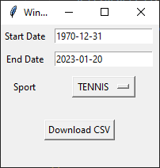
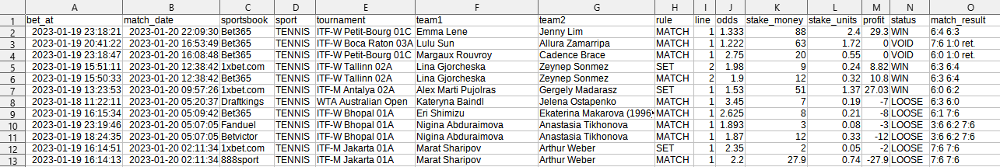
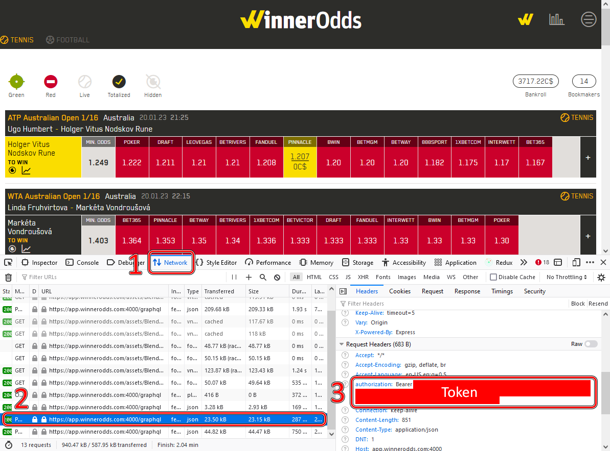

# WinnerOddsExport

Export your betting history from [WinnerOdds](https://winnerodds.com/) to a CSV file. This makes direct calls to the API.

Precompiled binaries can be found in [Releases](https://github.com/arsym-dev/WinnerOddsExport/releases).




## Usage

1. Run the GUI
2. Get your token (see below) and paste it in the field
3. Set the start date, end date, and sport
4. Press "Download CSV"

It may take a few minutes if you have a large number of bets.

## Running from source

1. Make sure you have [Python3](https://www.python.org/downloads/) installed
2. Open a terminal and install all the dependencies:

```bash
pip3 install request python-dateutil tk
```

3. In the terminal, clone this repository and navigate to it:

```bash
git clone https://github.com/arsym-dev/WinnerOddsExport.git
cd WinnerOddsExport
```

4. Finally, run the GUI:

```bash
python3 gui.py
```

## Getting your token

To get your WinnerOdds authorization token, do the following:

1. Log in to [https://app.winnerodds.com](https://app.winnerodds.com)
2. Open the broswer inspector. You can do this by right clicking the page and pressing "Inspect".
3. In the inspector, go to the "Network" tab.
4. Refresh the WinnerOdds website. In the Network tab, you should see some entries that have the URL: `https://app.winnerodds.com:4000/graphql`
5. Click one of these entries, scroll down to "Request Headers" and find the field called "authorization". It should have a value of `Bearer <token>`. Copy this value and paste it into the "Token" field.

**DO NOT SHARE YOUR TOKEN WITH ANYONE**. If you do, other people may log into your account.


