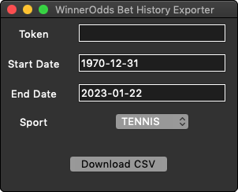

# WinnderOddsExport

Export your betting history from [WinnerOdds](https://winnerodds.com/) to a CSV file. This makes direct calls to the API.

Precompiled binaries exist in [Releases](https://github.com/arsym-dev/WinnerOddsExport/releases).

## Usage

Get your token (see below), then run the exporter to obtain your CSV file. It may take a few minutes if you have a large number of bets.

## Getting your token

To get your WinnerOdds authorization token, do the following:

1. Log in to [https://app.winnerodds.com](https://app.winnerodds.com)
2. Open the broswer inspector. You can do this by right clicking the page and pressing "Inspect".
3. In the inspector, go to the "Network" tab.
4. On the WinnerOdds website, change the page to the odds page or tracking page. You should now see a new entry in the Network tab that's calling `https://app.winnerodds.com:4000/graphql`
5. Click this entry, scroll down to "Request Headers" and find the field called "authorization". It should have a value of `Bearer <token>`
6. Copy the value of `<token>` and save it into "token.txt". **DO NOT SHARE YOUR TOKEN WITH ANYONE**. If you do, other people may log into your account.

